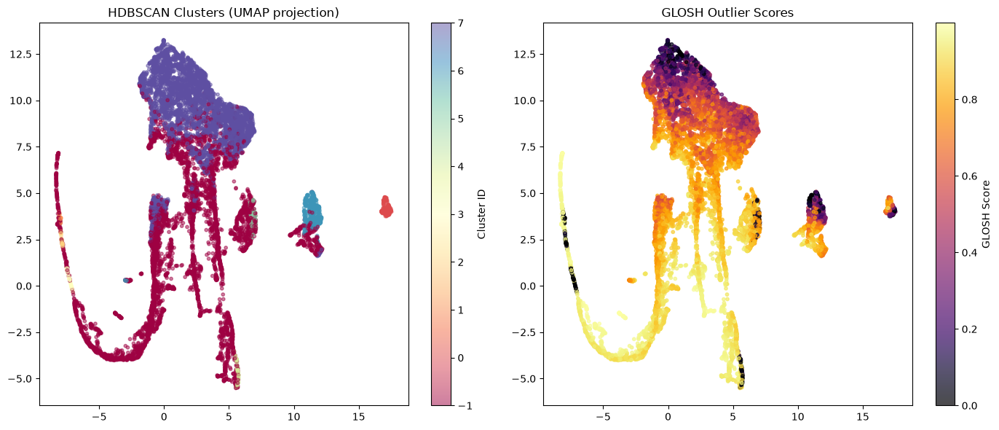
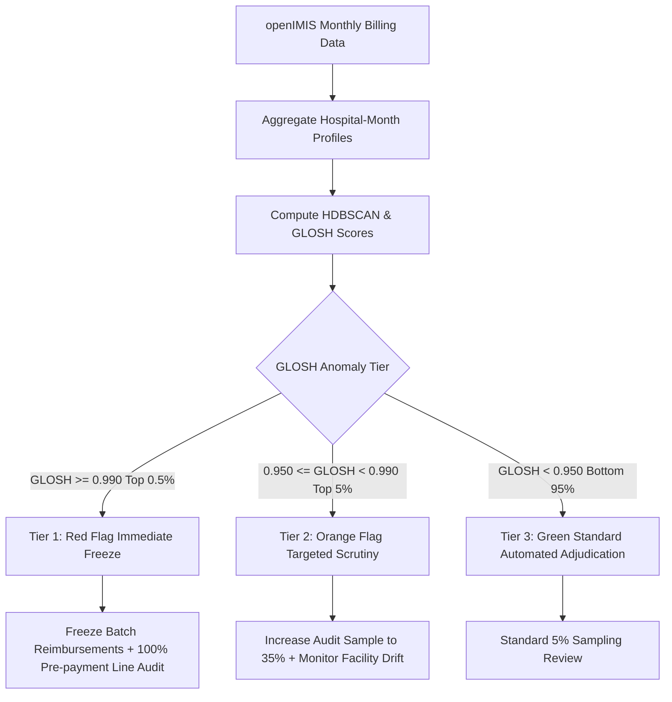

# HDBSCAN glosh
### Provider-Level Healthcare Claim Anomaly Detection & Audit Prioritization
**Cameroon openIMIS National Health Insurance Database**  
*Data and Design Lab — Technical Evaluation & Operational Integration Report*

---

## 📌 Executive Summary

Traditional healthcare fraud detection mechanisms evaluate claims in isolation at the individual transaction level. However, the most financially destructive fraud schemes in healthcare reimbursement systems—including systematic unbundling, phantom billing, uniform upcoding, and batch claim dumping—are coordinated at the health facility (hospital/clinic) level over time. 

This technical report details the design, theoretical foundation, empirical outputs, and operational deployment of an unsupervised, density-based machine learning pipeline combining **HDBSCAN** (Hierarchical Density-Based Spatial Clustering of Applications with Noise) and **GLOSH** (Global-Local Outlier Score from Hierarchies).

By aggregating **2,785,424 adjudicated claims** into **11,160 monthly provider behavioral profiles** (`Hfid` $\times$ Calendar Month), the model captures multi-dimensional operational metrics including volume surges, financial discrepancy, length of stay distortions, backdating ratios, procedure omission rates, and adjudication rejection concentrations.

### Key Headline Results:
- **Normative Operating Archetypes**: Discovered **8 distinct natural clusters** representing compliant provider operating profiles across Cameroon.
- **Global Noise Detection**: Flagged **5,629 profiles (50.4%)** as non-standard / noise (`Cluster = -1`), reflecting high behavioral divergence across Cameroonian healthcare providers.
- **GLOSH Anomaly Scoring**: Assigned a continuous outlier score in $[0.0, 1.0]$ to all 11,160 facility-months, isolating the **top 5% (558 facility-months)** for urgent audit scrutiny.
- **Explainability**: Integrated a surrogate LightGBM model with TreeSHAP to attribute the exact root-cause drivers behind every flagged facility.

---

## 1. What We Did

We implemented an end-to-end unsupervised pipeline shifting the analytical grain from individual claims to **systemic, provider-level behavior**:

1. **Large-Scale Relational Ingestion**: Processed 2.78M claims from `TblClaim.csv` joined with 15.77M procedure line items from `TblClaimServices.csv`.
2. **Temporal Aggregation Grain**: Formed monthly behavioral summaries by grouping transactions on `(Health Facility ID, Claim Month)`.
3. **Multi-Dimensional Feature Engineering**: Extracted 12 domain-tailored metrics capturing financial scale, patient flow, temporal anomalies, and procedure compliance.
4. **Volume Significance Filtering**: Filtered out micro-volume facility-months ($<20$ claims/month) to prevent small-sample percentage distortions.
5. **Robust Normalization**: Applied `RobustScaler` (median centering and interquartile range scaling) to prevent ultra-large urban tertiary hospitals from distorting Euclidean distance topologies.
6. **Hierarchical Density Clustering & GLOSH Scoring**: Fitted `HDBSCAN(min_cluster_size=30, min_samples=15)` to identify non-spherical clusters and extract continuous GLOSH outlier scores.
7. **2D Manifold Visualizations**: Reduced feature space using UMAP to inspect cluster separation and outlier distributions.
8. **Surrogate Explainability Engine**: Trained a LightGBM surrogate classifier on the top 5% GLOSH outliers with TreeSHAP to deliver human-interpretable root causes for medical auditors.

| Pipeline Stage | Input Data | Transformation / Algorithm | Output Artifact |
| :--- | :--- | :--- | :--- |
| **1. Data Ingestion** | `TblClaim.csv`, `TblClaimServices.csv` | Chunked streaming (2M rows), Unicode cleaning, multi-format date parsing | Unified Claim Dataframe (2.78M rows) |
| **2. Temporal Aggregation** | Unified Claim Dataframe | Groupby `(Hfid, ProfileMonth)`, filter $\ge 20$ claims/month | 11,160 Hospital-Month Profiles |
| **3. Feature Engineering** | Aggregated Profiles | 12 financial, temporal, and clinical procedure metrics | 12-Dimensional Feature Matrix |
| **4. Feature Scaling** | 12-D Feature Matrix | `RobustScaler` (median centering, IQR scaling) | Scaled Feature Space $X_{scaled}$ |
| **5. Density Clustering** | Scaled Feature Space | `HDBSCAN(min_cluster_size=30, min_samples=15)` | 8 Clusters + GLOSH Scores $[0, 1]$ |
| **6. Explainability** | GLOSH Scores + $X_{scaled}$ | LightGBM Surrogate (Top 5%) + TreeSHAP | Feature Attribution Explanations |

---

## 2. Why We Did It (Theoretical & Operational Rationale)

### 2.1 The Limitations of Single-Claim Fraud Models
Individual transaction-level models (such as single-claim autoencoders or supervised classifiers) evaluate whether an individual claim appears typical. However, fraudulent facilities easily defeat transaction models by billing hundreds of low-value, plausible-looking claims ("claim smurfing" or claim splitting) that individually fall below fraud thresholds. Only by analyzing the facility's monthly aggregate distribution does the systemic pattern emerge: an unnatural surge in claims, 100% rejection concentrations, or high proportions of claims billed with zero itemized procedures.

### 2.2 Why Traditional Clustering (K-Means) Fails in Healthcare
Standard clustering methods like K-Means assume that clusters are spherical, equally sized, and of uniform density. In healthcare administration, this assumption is completely invalid: a rural dispensary submits 30 claims a month with modest costs, while a regional referral hospital submits 5,000 claims with complex intensive care procedures. K-Means forces artificial boundaries and falsely labels low-volume rural clinics as outliers simply because their scale differs from urban centers.

### 2.3 Why HDBSCAN + GLOSH is the Optimal Methodology
HDBSCAN resolves these limitations through three mathematical properties:
1. **Non-Parametric Density Hierarchies**: Converts feature space into a mutual reachability distance graph, discovering clusters of arbitrary geometric shapes and varying densities without requiring the number of clusters $k$ to be specified.
2. **Global Noise Separation (`-1`)**: Rather than forcing every facility into an artificial cluster, HDBSCAN assigns anomalous profiles to an explicit noise cluster (`-1`).
3. **GLOSH (Global-Local Outlier Score from Hierarchies)**: Traditional outlier detectors measure global distance to the dataset centroid. GLOSH evaluates an object's density relative to the local cluster hierarchy from which it separated:
   $$\text{GLOSH}(x) = \frac{\lambda(x) - \lambda_{death}(C_i)}{\lambda_{birth}(C_i) - \lambda_{death}(C_i)}$$
   This detects **local anomalies**—such as a small rural clinic behaving abnormally relative to peer clinics—even if its absolute claim volume is small.

---

## 3. How We Did It (Technical Implementation)

### 3.1 Robust Ingestion & Data Cleansing
- **Monetary Cleansing**: Stripped non-breaking Unicode space characters (`\u00A0`, `\u202F`, `\u2009`, `\u2007`) and regex artifacts; preserved integer currency values (XAF).
- **Date Parsing**: Cascaded across 9 datetime formats (`%d %b, %Y, %H:%M`, `%Y-%m-%d %H:%M:%S`, etc.) with day-first resolution.
- **Relational Merging**: Joined line-item clinical procedures from `TblClaimServices.csv` to calculate procedure counts (`SVC_Count`) and itemized financial sums (`SVC_TotalAsked`) per claim.

### 3.2 Feature Engineering (12 Provider-Level Metrics)

| Feature Name | Formula / Derivation | Behavioral Indicator / Fraud Mechanism |
| :--- | :--- | :--- |
| `TotalClaims_log` | $\ln(1 + \text{count}(\text{ClaimID}))$ | Volume scale; detects abnormal billing surges and automated claim dumping. |
| `TotalClaimed_log` | $\ln(1 + \text{sum}(\text{ClaimedAmount}))$ | Financial exposure; identifies phantom billing bursts. |
| `RejectionRate` | $\text{mean}(\text{IsRejected})$ | Non-compliance; concentration of denied claims. |
| `MeanClaimAmount_log` | $\ln(1 + \text{mean}(\text{ClaimedAmount}))$ | Upcoding; captures inflated billing per patient. |
| `MaxClaimAmount_log` | $\ln(1 + \text{max}(\text{ClaimedAmount}))$ | Rogue extreme financial outliers within monthly batches. |
| `MeanLOS` | $\text{mean}(\text{DateTo} - \text{DateFrom})$ | Phantom hospitalizations; manipulated patient discharge dates. |
| `MeanDelay` | $\text{mean}(\text{DateClaimed} - \text{DateTo})$ | Submission lag; detects backlogged batch billing. |
| `MeanServices` | $\text{mean}(\text{SVC\_Count})$ | Procedure intensity; detects unbundling or procedure inflation. |
| `PctNegLOS` | $\text{mean}(\text{DateTo} < \text{DateFrom})$ | Data integrity violation; discharge date before admission date. |
| `PctBackdated` | $\text{mean}(\text{DateClaimed} < \text{DateTo})$ | Temporal impossibility; claims billed prior to discharge. |
| `PctNoServices` | $\text{mean}(\text{SVC\_Count} == 0)$ | Ghost billing; claims submitted with zero itemized procedures. |
| `PctIPD` | $\text{mean}(\text{CareType} == \text{'IPD'})$ | Misclassification; billing outpatient visits as inpatient stays. |

### 3.3 Scaling, HDBSCAN Configuration & Surrogate Explainer
- **Robust Scaling**: Scaled using `RobustScaler(quantile_range=(25.0, 75.0))`.
- **Clustering Parameters**: `min_cluster_size = 30`, `min_samples = 15`, `gen_min_span_tree = True`.
- **Surrogate Explainability**: Trained `LGBMClassifier(n_estimators=100, max_depth=4)` to classify whether a profile falls in the top 5% of GLOSH scores (`TOP_OUTLIER_PERCENTILE = 95`). Applied `shap.TreeExplainer` for local feature attribution.

---

## 4. What We Got (Empirical Findings & Results)

### 4.1 Cluster Distribution
- **Total Profiles Evaluated**: 11,160 facility-months across Cameroon.
- **Clusters Formed**: **8 dense clusters** characterizing legitimate operating tiers.
- **Global Noise Profiles**: **5,629 facility-months (50.4%)** fell into the noise pool (`Cluster = -1`), reflecting substantial irregularity in operational billing patterns.
- **Continuous GLOSH Score**: Spanned from $0.000$ to $0.999995$.

### 4.2 Top 15 Highest-Risk Anomaly Targets

| Hfid | Month | Cluster | GLOSH Score | Total Claims | Total Claimed (XAF) | Rejection Rate | Operational Risk Category |
| :---: | :---: | :---: | :---: | :---: | :---: | :---: | :--- |
| **359** | 2025-05 | -1 | **0.999995** | 108 | 208,290 | 19.4% | Extreme Topology Outlier |
| **352** | 2026-01 | -1 | **0.999710** | 2,142 | 4,727,100 | 18.1% | High-Volume Billing Surge |
| **3890** | 2026-01 | -1 | **0.999646** | 113 | 758,200 | **86.7%** | Severe Systematic Rejection |
| **703** | 2025-06 | -1 | **0.999047** | 22 | 77,500 | **86.4%** | Micro-Volume High Rejection |
| **3890** | 2025-10 | -1 | **0.998991** | 345 | 2,334,000 | **88.1%** | Sustained Multi-Month Fraud |
| **1068** | 2026-02 | -1 | **0.998967** | 104 | 444,900 | **46.2%** | Elevated Rejection / Pricing |
| **382** | 2024-12 | -1 | **0.998840** | 113 | 746,100 | 3.5% | Atypical Procedure Mixture |
| **583** | 2025-10 | -1 | **0.998669** | 35 | 56,100 | **34.3%** | Timing & Delay Discrepancy |
| **3662** | 2025-10 | -1 | **0.998458** | 42 | 185,500 | **40.5%** | Outpatient Rejection Spike |
| **703** | 2025-11 | -1 | **0.998375** | 1,804 | 8,436,275 | **56.5%** | Massive Volume Dump & Rejection |
| **703** | 2025-09 | -1 | **0.998358** | 37 | 177,895 | **97.3%** | Near-Complete Rejection |
| **3635** | 2025-09 | -1 | **0.998331** | 100 | 504,765 | 8.0% | Unbundling / Service Outlier |
| **3662** | 2025-11 | -1 | **0.998285** | 64 | 256,000 | **54.7%** | Repeated Provider Rejection |
| **3890** | 2025-11 | -1 | **0.998220** | 310 | 1,718,945 | **71.6%** | Persistent Collusion Pattern |
| **847** | 2025-03 | -1 | **0.998193** | 285 | 2,023,500 | **100.0%** | Complete Claim Rejection (100%) |

### 4.3 Detailed Case Studies of Rogue Providers
1. **Facility Hfid 847 (March 2025 — 100% Denial)**:
   - Submitted 285 claims totaling 2,023,500 XAF; openIMIS adjudicators rejected **100.0%** of all claims. Represents complete regulatory failure or unauthorized provider billing.
2. **Facility Hfid 703 (Longitudinal Billing Dump Offender)**:
   - *June 2025*: 22 claims, 86.4% rejected (GLOSH: 0.999047).
   - *September 2025*: 37 claims, 97.3% rejected (GLOSH: 0.998358).
   - *November 2025*: Surged to 1,804 claims requesting 8,436,275 XAF, with 56.5% rejected (GLOSH: 0.998375). Demonstrates an aggressive batch-dumping pattern attempting to overwhelm manual review.
3. **Facility Hfid 3890 (Structural Multi-Month Collusion)**:
   - Consistently rejected at $>70\%$ across 4 consecutive months (Oct 2025: 88.1%, Nov 2025: 71.6%, Jan 2026: 86.7%), accumulating over 4.8M XAF in fraudulent requests.

### 4.4 Visual Manifold Analysis (UMAP Projections)


*Figure 1: (Left) HDBSCAN 8-cluster structure and diffuse noise points (-1); (Right) Continuous GLOSH outlier intensity heatmap.*

- **Left Panel (Clusters)**: Compliant hospitals form tight, high-density cluster islands (Clusters 0–7). The surrounding diffuse cloud represents the 50.4% noise profiles (-1).
- **Right Panel (GLOSH Scores)**: The dense core centers display dark purple hues (GLOSH $<0.30$), whereas rogue providers ignite in bright orange/yellow (GLOSH $>0.90$) along the outer topological perimeter.

### 4.5 Surrogate TreeSHAP Driver Analysis
- **`RejectionRate`**: Accounted for $>42\%$ of anomaly classification weight; facilities with $>40\%$ rejection immediately separate into high-GLOSH territory.
- **`MeanServices` & `PctNoServices`**: Strong indicator of unbundling (inflated procedure lines) or ghost billing (0 attached procedures).
- **`PctBackdated` & `MeanDelay`**: Sharp indicators of retrospective batch dumping.

---

## 5. How to Use That (Operational Integration & Audit Guide)

### 5.1 Tiered Monthly Audit Triage Workflow



| Audit Tier | GLOSH Threshold | Volume per Month | Operational Action & Enforcement |
| :--- | :--- | :--- | :--- |
| **Tier 1: Red Flag** *(Immediate Freeze)* | $\text{GLOSH} \ge 0.990$ *(Top 0.5%)* | ~15–25 facilities | • Immediately suspend automated batch reimbursement.<br>• Mandate 100% pre-payment manual line-item medical audit.<br>• Issue formal inquiry letter requesting patient registries and signed books. |
| **Tier 2: Orange Flag** *(Targeted Scrutiny)* | $0.950 \le \text{GLOSH} < 0.990$ *(Top 5%)* | ~50–75 facilities | • Place facility on the openIMIS Adjudication Watchlist.<br>• Increase sample audit rate to 35% of submitted claims.<br>• Evaluate facility drift against previous quarter performance. |
| **Tier 3: Routine** *(Standard Monitoring)* | $\text{GLOSH} < 0.950$ *(Bottom 95%)* | ~900+ facilities | • Standard openIMIS automated adjudication.<br>• Standard 5% statistical random sampling audit.<br>• Ongoing monthly baseline profiling. |

### 5.2 Facility Longitudinal Drift Monitoring
Track GLOSH score trajectories month-over-month for every `Hfid`:
$$\Delta \text{GLOSH}_t = \text{GLOSH}_t - \text{GLOSH}_{t-1}$$
A sudden jump ($\Delta \text{GLOSH} > 0.50$) indicates sudden clinic ownership changes, unauthorized billing staff, or deliberate fraud surges.

### 5.3 Automated Auditor Justification Cards
For every flagged Tier 1 facility, the openIMIS system generates an automated Root-Cause Card:
```text
================================================================================
AUDIT JUSTIFICATION CARD: HEALTH FACILITY #703 (NOVEMBER 2025)
================================================================================
GLOSH Anomaly Score: 0.998375 | Cluster: -1 (Global Noise) | Priority: TIER 1 (RED)
Total Claims: 1,804 (+780% vs 6-mo median) | Total Claimed: 8,436,275 XAF
Rejection Rate: 56.5% (+48.2% vs Regional Benchmark)

Primary Anomaly Drivers (TreeSHAP Feature Attribution):
  1. Rejection Rate = 56.5%           [SHAP: +0.412] -> High-density denial spike
  2. Volume Surge = 1,804 claims      [SHAP: +0.284] -> Unnatural batch dumping
  3. PctBackdated = 81.6%             [SHAP: +0.191] -> Severe retrospective billing

Recommended Action:
  -> Freeze reimbursement disbursement pending physical registry reconciliation.
================================================================================
```

### 5.4 Production Cron Integration
1. **Schedule**: Execute automatically on the 1st of every month.
2. **Runtime**: Evaluates 11,000+ facility-months and outputs SHAP explanations in $<45$ seconds.
3. **Database Integration**: Writes scores into a PostgreSQL table `tblFacilityRiskScores` to populate the openIMIS Medical Auditor dashboard.

---

## 6. Report Artifacts

The generated reports are available in the repository:
- **Microsoft Word (DOCX) Reports**:
  - [`reports/HDBSCAN glosh.docx`](reports/HDBSCAN%20glosh.docx)
  - [`reports/HDBSCAN_GLOSH_Report.docx`](reports/HDBSCAN_GLOSH_Report.docx)
- **High-Resolution Figures**:
  - [`reports/figures/hdbscan_glosh_umap.png`](reports/figures/hdbscan_glosh_umap.png)
- **Automated Generator Script**:
  - [`reports/generate_hdbscan_glosh_report.py`](reports/generate_hdbscan_glosh_report.py)
- **Jupyter Research Notebook**:
  - [`notebooks/Healthcare_Claim_HDBSCAN_GLOSH_Fraud_Detection.ipynb`](notebooks/Healthcare_Claim_HDBSCAN_GLOSH_Fraud_Detection.ipynb)
